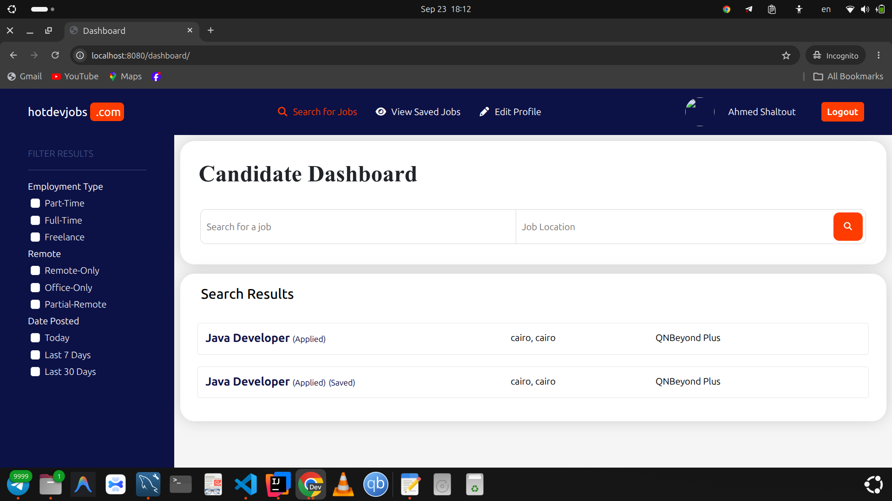
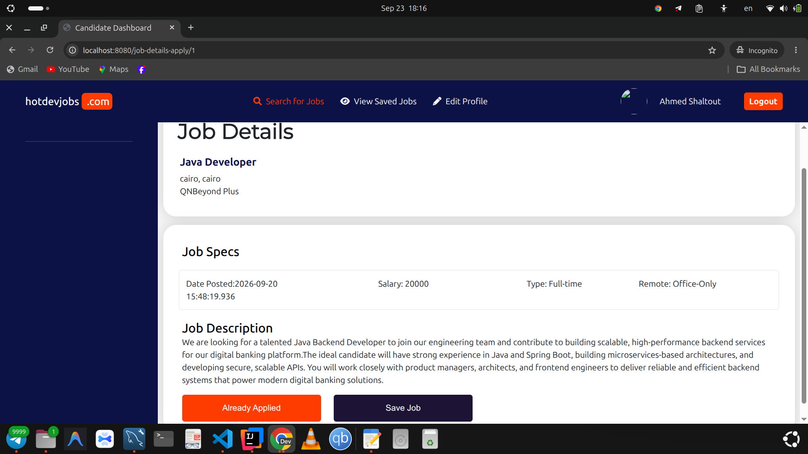
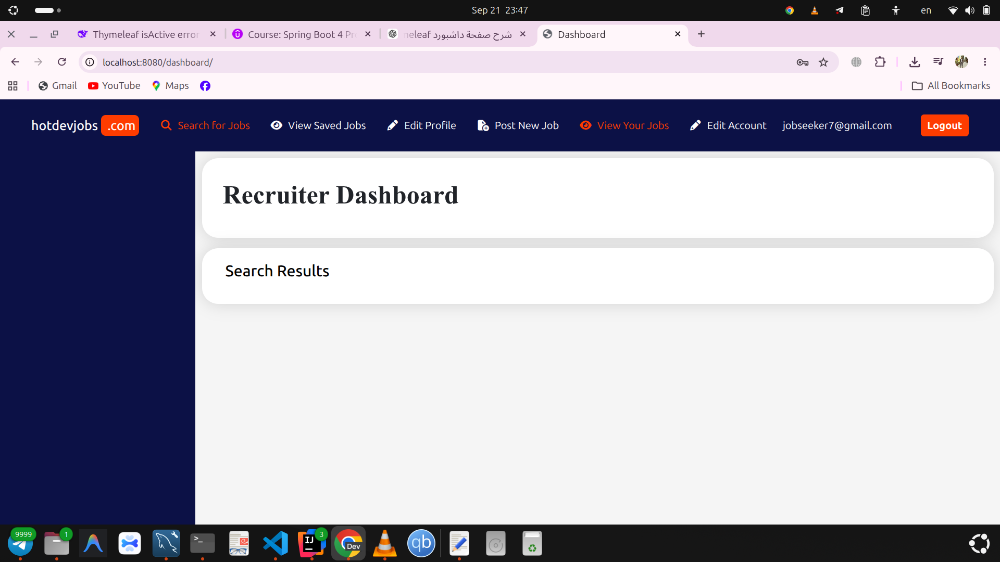

# Job Portal Web Application

A role-based job portal web application built with **Java, Spring Boot, Spring Security, Thymeleaf, Spring Data JPA, Hibernate, and MySQL**.

The application provides separate workflows for **Job Seekers** and **Recruiters**, including authentication, profile management, job searching, job applications, saved jobs, recruiter dashboards, and candidate resume management.

## 📌 Overview

The goal of this project is to build a web-based recruitment platform that connects job seekers with recruiters through a structured and secure application.

The project was developed incrementally, starting with user registration and authentication, then expanding into profile management, recruiter dashboards, job searching, applying for jobs, saving jobs, and resume handling.

## ✨ Features

### 🔐 Authentication and Authorization

- User registration and login
- Login and logout request mappings
- Custom authentication success handler
- Spring Security integration
- Role-based authorization
- Support for Job Seeker and Recruiter user roles

### 👤 Job Seeker Features

- Create and manage a Job Seeker profile
- Integrate the dashboard with the currently logged-in user
- Search for available jobs
- Apply for job opportunities
- Save jobs for later review
- Manage candidate profile information
- Upload candidate files, including resumes
- Access saved jobs and application-related functionality

### 🏢 Recruiter Features

- Create and manage a Recruiter profile
- Upload recruiter profile files
- Access a Recruiter Dashboard
- Create and manage job-related information
- Download candidate resumes

### 🗃️ Domain and Persistence

- JPA entity modeling
- Spring Data repositories
- Service-layer business logic
- Entity support for job applications and saved jobs
- MySQL database integration
- Relationship mapping between users, profiles, jobs, applications, and saved jobs

## 🛠️ Tech Stack

| Category | Technology |
|---|---|
| Language | Java |
| Backend Framework | Spring Boot |
| Web Framework | Spring MVC |
| Security | Spring Security |
| View Layer | Thymeleaf |
| ORM | Hibernate |
| Persistence | Spring Data JPA |
| Database | MySQL |
| Build Tool | Maven |
| Version Control | Git and GitHub |

## 🏗️ Application Architecture

The project follows a layered Spring Boot architecture:

```text
Controller Layer
       |
       v
Service Layer
       |
       v
Repository Layer
       |
       v
MySQL Database
```

### Main layers

- **Controller:** Handles incoming HTTP requests and returns views or responses.
- **Service:** Contains application and business logic.
- **Repository:** Provides database access through Spring Data JPA.
- **Entity:** Represents the application's domain model and database relationships.
- **Security:** Handles authentication, authorization, and authenticated-user workflows.
- **Resources:** Contains Thymeleaf templates, static assets, and uploaded-file handling.

## 🧩 Main Domain Concepts

The project includes functionality related to:

- Users and user types
- Job Seeker profiles
- Recruiter profiles
- Job posts
- Job applications
- Saved jobs
- Candidate resumes
- Recruiter dashboards

The exact entity names and relationships should be kept synchronized with the current source code.

## 📸 Screenshots

Store project screenshots in:

```text
docs/screenshots/
```

Recommended screenshot structure:

```text
docs/
└── screenshots/
    ├── login.png
    ├── registration.png
    ├── jobseeker-dashboard.png
    ├── jobseeker-profile.png
    ├── job-details.png
    ├── saved-jobs.png
    ├── recruiter-dashboard.png
    ├── recruiter-profile.png
    └── job-application.png
```

### Login


### Job Seeker Dashboard



### Job Details



### Recruiter Dashboard



> Replace the screenshot filenames with the actual files in your repository. Remove sections for screenshots that you do not have.

## 🚀 Getting Started

### Prerequisites

Install the following before running the application:

- Java 17 or later
- Maven
- MySQL
- Git

### 1. Clone the repository

```bash
git clone https://github.com/YOUR_USERNAME/job-portal-web-application.git
cd job-portal-web-application
```

### 2. Create the database

Create a MySQL database for the application:

```sql
CREATE DATABASE jobportal;
```

### 3. Configure the application

Configure the database connection in your local Spring Boot configuration.

Example:

```properties
spring.datasource.url=jdbc:mysql://localhost:3306/jobportal
spring.datasource.username=${DB_USERNAME}
spring.datasource.password=${DB_PASSWORD}

spring.jpa.hibernate.ddl-auto=update
spring.jpa.show-sql=false
```

Use your actual property names and database configuration. Do not commit real passwords or private credentials.

### 4. Run the application

Using the Maven Wrapper:

```bash
./mvnw spring-boot:run
```

Or, if Maven is installed globally:

```bash
mvn spring-boot:run
```

The application is commonly available at:

```text
http://localhost:8080
```

## 🔒 Security and Privacy

Before publishing the repository:

- Remove database passwords and private credentials.
- Do not commit API keys or secret tokens.
- Review `application.properties` and local configuration files.
- Do not upload real candidate resumes or personal documents.
- Avoid committing logs that contain emails, usernames, file paths, or other personal information.
- Use environment variables or local configuration for sensitive values.

## 📁 Recommended Repository Structure

```text
job-portal-web-application/
├── src/
│   ├── main/
│   │   ├── java/
│   │   └── resources/
│   └── test/
├── docs/
│   └── screenshots/
├── .gitignore
├── pom.xml
├── README.md
└── mvnw
```

## 🧭 Development Progress

The project was developed through incremental feature-focused commits, including:

1. User registration and profile management
2. Spring Security configuration
3. Custom authentication success handling
4. Current-user dashboard integration
5. Login and logout mappings
6. Recruiter profile creation
7. Recruiter file upload
8. Recruiter dashboard
9. Job Seeker profile support
10. Job application and saved-job entities
11. Searching and applying for jobs
12. Saving jobs
13. Recruiter candidate resume download

## 🔮 Potential Improvements

Possible future enhancements include:

- Automated unit and integration tests
- Pagination for job listings
- Advanced job filtering
- Email notifications
- Application status tracking
- REST API endpoints
- Docker support
- CI/CD pipeline
- Cloud deployment
- Improved validation and centralized exception handling

## 👨‍💻 Author

**Ahmed Shaltout**

Java Backend Developer

- GitHub: `https://github.com/Gamal-Cs`
- LinkedIn: `https://www.linkedin.com/in/ahmedshaltout1/`

## 📄 License

Add a license if you want other developers to reuse, modify, or distribute the project under defined terms.